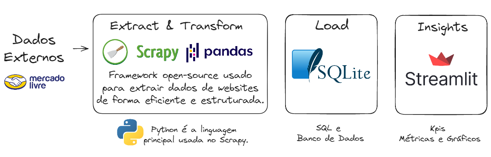

<h1 align="center">Pipeline ETL Python - Web Scraping com Scrapy</h1>

    

Conteúdo do estudo > [Clique para construir um projeto de dados do zero com Luciano Galvão.](https://www.youtube.com/watch?v=qNu1VCtUedg&t=607s)

