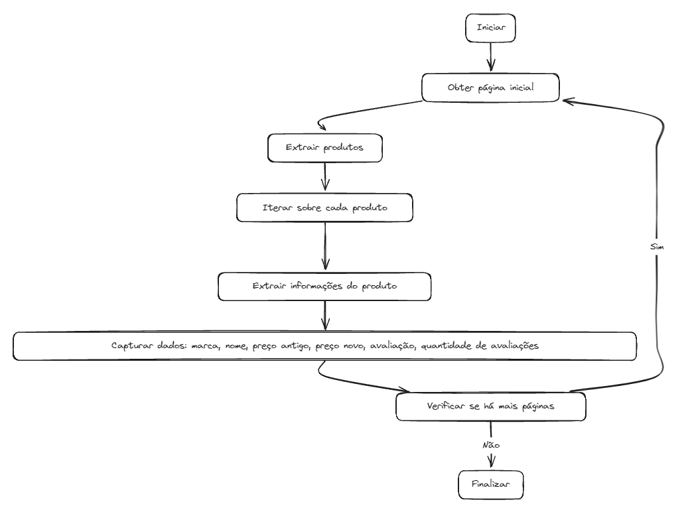
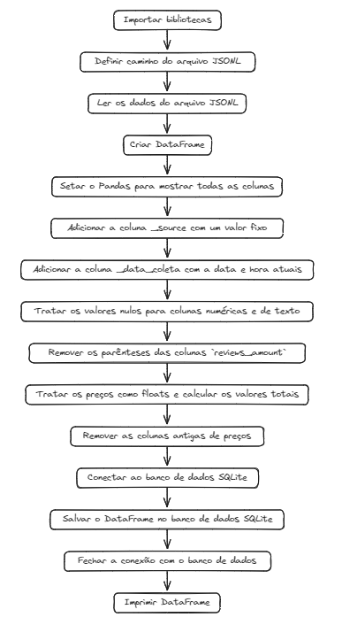

<h1 align="center">Pipeline ETL Python - Web Scraping com Scrapy</h1>

<div align="center">
    
</div>


Conteúdo do estudo > [Clique para construir um projeto de dados do zero com Luciano Galvão.](https://www.youtube.com/watch?v=qNu1VCtUedg&t=607s)

<h1 align="center"> Diagrama do Fluxo: Coleta </h1>

<div align="center">
    
</div>

<h1 align="center">Funcionalidades</h1>

Este projeto é um web spider desenvolvido utilizando a biblioteca Scrapy em Python, destinado a extrair informações de produtos da plataforma MercadoLivre.

### Extração de Dados:
- O spider é capaz de acessar a página inicial de uma categoria específica de produtos no MercadoLivre e extrair informações detalhadas de cada produto listado, incluindo marca, nome, preços antigo e novo, avaliação e quantidade de avaliações.
### Iteração sobre Páginas:
- O spider é projetado para iterar sobre múltiplas páginas de resultados de pesquisa, permitindo a coleta de um grande volume de dados.
### Limitação de Páginas:
- O número máximo de páginas que o spider pode percorrer é configurável para controlar o escopo da extração de dados.
### Exportação de Dados: 
- Os dados extraídos podem ser exportados para diferentes formatos, como JSON, CSV, ou diretamente para um banco de dados, para posterior análise e processamento.

<h1 align="center"> Diagrama do Fluxo: Transformação </h1>

<div align="center">
    
</div>

<h1 align="center">Instalação</h1>

### Clone o repositório:
```
$ git clone https://github.com/IasmimHorrana/web-scraping.git
$ cd web-scraping
```
### Crie um ambiente virtual:
```
$ python -m venv venv 
$ venv\Scripts\activate 
$ pip install scrapy 
```
- Cria o ambiente virtual / Ativar o ambiente no windows / Instalar o Scrapy dentro do ambiente virtual.

### Instalar as dependências:
```
$ pip install -r requirements.txt
```
### Executar o Spider:
```
$ scrapy crawl mercadolivre
```
### Executar a interface de análise com Streamlit:
```
$ streamlit run app.py
```
### Fim.